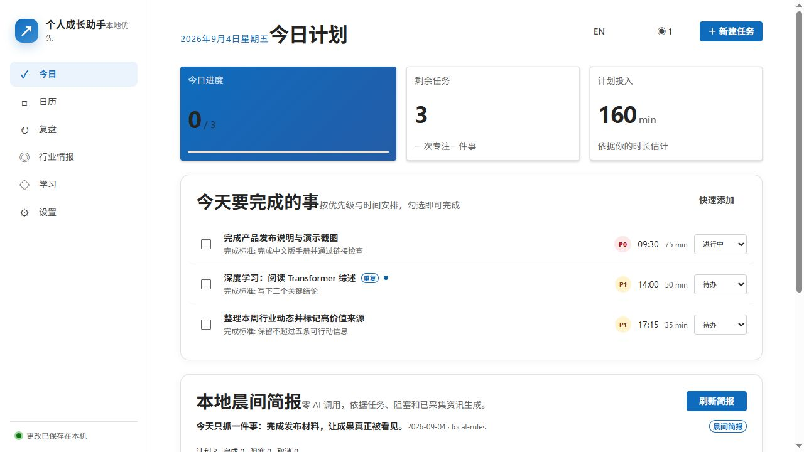
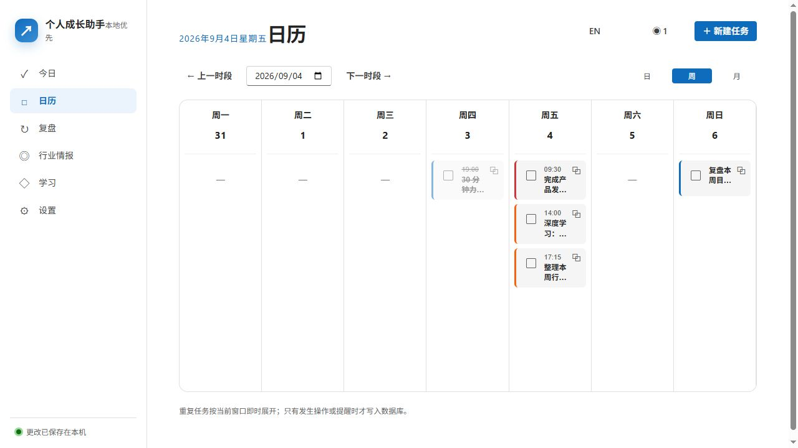
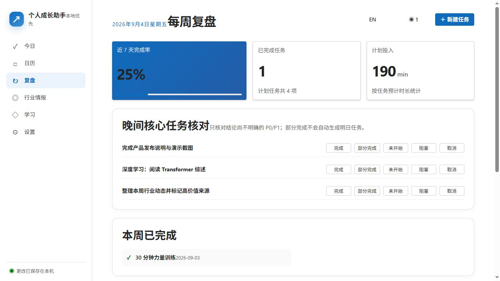
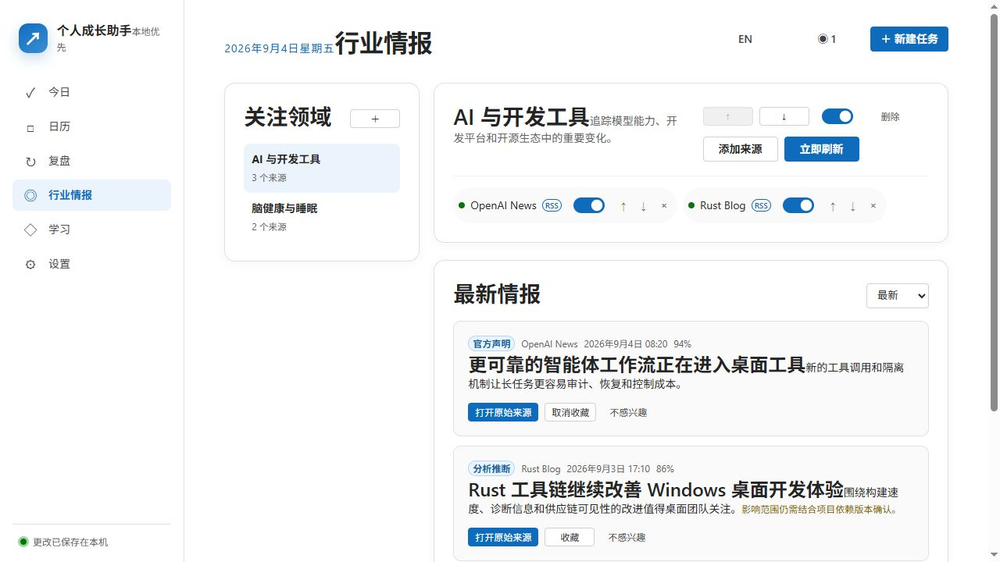
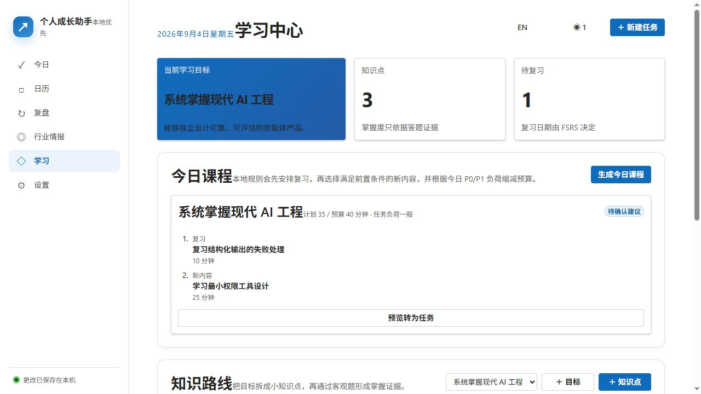

# Personal Growth Assistant

> 把“我想变得更好”，变成今天真正完成的一件事。

[](LICENSE)
[](https://github.com/1ZYZz/personal-growth-assistant/releases/latest)
[](SECURITY.md)
[](https://tauri.app/)

**Personal Growth Assistant（个人成长助手）** 是一款本地优先的 Windows 桌面应用。它把任务、日历、复盘、行业情报与学习计划放进同一个闭环：看见重点，安排今天，持续复盘，再把信息真正变成行动。

[下载最新版](https://github.com/1ZYZz/personal-growth-assistant/releases/latest) · [中文用户手册](docs/user-guide.zh-CN.md) · [English](README.en.md) · [参与贡献](CONTRIBUTING.md)



## 为什么值得一试

- **今天不再失控。** 任务、时间预算、逾期提醒和晨间简报集中在一个安静的工作台。
- **重复任务真正可靠。** 支持按天、周、月循环，以及“仅本次 / 本次及以后 / 整个系列”编辑。
- **信息不只是收藏。** 聚合可信来源，去重、评分、收藏，并把值得跟进的情报转成任务。
- **学习可以被执行。** 用目标、前置知识、每日课程、测验和间隔复习组成可持续路径。
- **AI 是可选增强，不是使用门槛。** 离线核心能力完整可用；启用 Codex 后可生成结构化建议。
- **你的数据首先属于你。** 无账号系统、无产品遥测、无默认云同步，SQLite 数据保存在本机。

## 一眼看懂工作流

```text
捕捉任务 → 安排日历 → 晨间聚焦 → 执行与提醒 → 晚间复盘
    ↑                                            ↓
行业情报 → 收藏/转任务              学习计划 → 测验/间隔复习
```

## 核心界面

| 日历与任务                            | 复盘                                |
| ------------------------------------- | ----------------------------------- |
|  |  |

| 行业情报                                      | 学习系统                              |
| --------------------------------------------- | ------------------------------------- |
|  |  |

## 3 分钟开始使用

1. 从 [Releases](https://github.com/1ZYZz/personal-growth-assistant/releases/latest) 下载 `Personal Growth Assistant_*_x64-setup.exe`。
2. 运行安装程序。当前安装包尚未进行商业代码签名；若 SmartScreen 提示，请核对发布页中的 SHA-256 后选择继续。
3. 首次启动时确认语言、时区、主题、通知与托盘偏好。
4. 在“今日”点击“新建任务”，先添加一件真正重要的事。
5. 向下找到“晨间简报”，点击“立即生成本地简报”。本地简报无需登录、无需联网。

完整步骤、自动生成时间和 Codex 智能建议设置见 [《用户手册》](docs/user-guide.zh-CN.md)。

## 功能概览

### 任务、日历与提醒

支持今日清单，日/周/月日历，拖动改期，复制和批量移动，优先级、进度、完成标准、稍后提醒、取消与回收站；支持全天、浮动时间和 IANA 时区，以及 DST 场景下的确定性重复规则处理。Windows 原生提醒可直接完成、稍后提醒或打开任务。

### 晨间简报与复盘

本地简报根据当天任务和时间预算即时生成，不依赖 AI。应用也可按设定时间自动生成晨报、晚报和周报。可选的 Codex 集成会在隔离环境中生成只读、结构化建议，并提供次数与预算限制、缓存、超时和取消能力。

### 行业情报

支持 RSS/Atom、JSON API 与基础静态页面来源；包含 HTTPS 限制、DNS 固定、私网地址阻断、正文大小限制、跨来源事件去重、评分、收藏和反馈。外部内容始终按不可信数据处理。

### 学习系统

把长期目标拆成带前置关系的知识节点，自动组织每日课程和预计用时，通过客观测验、错题记录和 FSRS 间隔复习巩固掌握；课程建议只有在用户批准后才能转成任务。

## 隐私与安全

- 业务数据以本机 SQLite 为唯一事实来源。
- Web 界面和 AI sidecar 均不能直接打开数据库。
- 默认没有账号、遥测、崩溃上传或自动云同步。
- Codex 使用独立目录与专用配置，不读取用户日常 Codex 历史、Skills 或 MCP 设置。
- 信息源只允许 HTTPS，并拦截私网/保留地址、凭据 URL、重定向和超大响应。
- 支持自动备份、手动备份、校验后重启恢复，以及隐私安全的 JSON 导出。

详见 [安全策略](SECURITY.md) 与 [威胁模型](docs/threat-model.md)。发现漏洞请遵循安全策略私下报告，不要公开提交含利用细节或个人数据的 Issue。

## 本地开发

环境要求：Windows x64、Node.js 24.19、pnpm 11.19、Rust 1.98 MSVC、Microsoft C++ Build Tools、Windows SDK 和 WebView2。

```powershell
pnpm install --frozen-lockfile
pnpm format:check
pnpm lint
pnpm typecheck
pnpm test
pnpm rust:fmt
pnpm rust:clippy
pnpm rust:test
pnpm sbom
pnpm desktop:build
```

依赖已锁定。`pnpm sbom` 会执行许可证门禁并生成 CycloneDX 1.6 软件物料清单。架构与边界说明见 [项目文档](docs/)，发行验证见 [release-1.1.1.md](docs/verification/release-1.1.1.md)。

## 参与开源

欢迎提交 Bug、功能建议、文档改进和代码贡献。开始前请阅读 [贡献指南](CONTRIBUTING.md)、[行为准则](CODE_OF_CONDUCT.md) 与 [安全策略](SECURITY.md)。

## 许可证

本项目使用 [Apache License 2.0](LICENSE)。第三方组件保留各自许可证，详见 [THIRD_PARTY_NOTICES.md](THIRD_PARTY_NOTICES.md)、[sbom.cdx.json](sbom.cdx.json) 与 [上游代码映射](docs/upstream-map.md)。

---

**不是再多一个待办清单，而是让计划、信息和成长终于彼此相连。**
