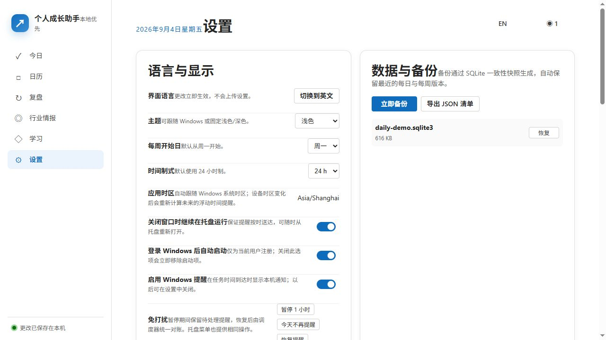

# Personal Growth Assistant 用户手册

适用版本：1.1.1 · 平台：Windows x64 · 更新日期：2026-09-04

## 目录

1. [认识这款软件](#1-认识这款软件)
2. [安装与首次启动](#2-安装与首次启动)
3. [创建并完成第一个任务](#3-创建并完成第一个任务)
4. [生成晨间简报](#4-生成晨间简报)
5. [使用日历与重复任务](#5-使用日历与重复任务)
6. [完成每日与每周复盘](#6-完成每日与每周复盘)
7. [配置行业情报](#7-配置行业情报)
8. [建立学习计划](#8-建立学习计划)
9. [备份、恢复与导出](#9-备份恢复与导出)
10. [常见问题](#10-常见问题)

## 1. 认识这款软件

Personal Growth Assistant 把五类日常工作放在同一个本地应用中：

- **今日**：决定今天最重要的事，并查看时间容量与晨间简报。
- **日历**：从日、周、月视角安排一次性或重复任务。
- **复盘**：查看执行结果、延期情况和下一步建议。
- **行业情报**：集中阅读可信来源，把重要信息收藏或转成任务。
- **学习**：把长期目标拆成知识节点、课程、测验和复习计划。

## 2. 安装与首次启动

1. 打开项目的 [GitHub Releases](https://github.com/1ZYZz/personal-growth-assistant/releases/latest)。
2. 下载文件名以 `_x64-setup.exe` 结尾的安装包，以及同一发布中的 SHA-256 校验文件。
3. 运行安装程序。安装不要求管理员权限，也不要求电脑预装 Node.js。
4. 当前版本尚未进行商业代码签名。如果 Windows SmartScreen 提示“Windows 已保护你的电脑”，请先核对校验值，再选择“更多信息”→“仍要运行”。
5. 首次启动时依次确认界面语言、系统时区、通知权限、主题和托盘行为。

软件默认把业务数据保存在当前 Windows 用户的应用数据目录。升级和普通卸载不会主动删除业务数据。

## 3. 创建并完成第一个任务

1. 打开左侧导航的“今日”。
2. 点击右上角“新建任务”。
3. 输入标题，并按需设置日期、时间、预计时长、优先级、完成标准和重复规则。
4. 保存后，任务会进入当天清单与日历。
5. 执行时可更新进度；完成后勾选任务。若暂时无法处理，可使用“稍后提醒”“阻塞”或“取消”。

建议第一次只添加 3—5 件事，并为它们填写预计时长。系统会据此提示当天是否过载。

## 4. 生成晨间简报

软件提供两种不同的简报。**本地简报开箱即用；Codex 智能建议是可选增强。**

### 4.1 立即生成本地晨间简报（推荐首次使用）

1. 至少创建一项今天的任务。
2. 打开“今日”，向下滚动到“晨间简报”卡片。
3. 点击“立即生成本地简报”（已有简报时按钮会显示为重新生成/刷新）。
4. 简报会根据当天任务、优先级、预计时长和逾期情况，在本机即时生成。

这条路径无需 Codex 登录、无需联网，也不会把任务发送到外部服务。

### 4.2 让软件每天自动生成

1. 打开“设置”。
2. 找到“自动任务/日程”区域。
3. 开启晨间简报，设置生成时间（默认可使用 08:00）。
4. 保存设置，并保持“关闭窗口时继续在托盘运行”为开启状态。

到达设定时间后，后台调度器会生成本地简报。若电脑当时关机，应用会在恢复运行后按照调度规则补偿处理。

### 4.3 使用 Codex 生成智能建议（可选）

1. 打开“设置”→“AI Runtime / Codex”。
2. 点击检测运行时。如果未登录，选择“隔离登录”，按提示完成一次登录。
3. 重新检测，确认状态可用。
4. 开启 AI 功能，选择节省、标准或深入模式，并设置每日/月度次数与预算限制后保存。
5. 返回“今日”的晨间简报卡片，点击“使用 Codex 生成建议”。
6. 等待结构化建议返回；生成期间可以取消。

Codex 在专用配置目录和每次新建的工作目录中运行，不读取日常 Codex 历史、Skills 或 MCP 配置。即使 Codex 不可用，本地简报、任务、提醒、备份和学习功能仍可正常工作。

## 5. 使用日历与重复任务

“日历”支持日、周、月三种视图。可通过日期选择器跳转，也可拖动任务改期。

### 创建重复任务

在任务编辑器中选择重复频率和结束条件。编辑已经出现的重复任务时，软件会询问作用范围：

- **仅本次**：只改当前这一次。
- **本次及以后**：保留历史，从当前实例开始改变后续计划。
- **整个系列**：修改整个重复系列。

删除的任务会先进入回收站，可在彻底清理前恢复。复制按钮可快速创建内容相同的新任务。

## 6. 完成每日与每周复盘

打开“复盘”，选择日期范围，即可查看完成、延期、取消和时间投入情况。

推荐的复盘顺序：

1. 先看完成率与计划偏差，不急于评价自己。
2. 给未完成任务标记真实原因：估时不足、优先级变化、被阻塞或精力不足。
3. 只保留一个明确改进动作，例如“明天最多安排三项高优先级任务”。
4. 将仍然有效的事项改期；已经失去价值的事项直接取消。

## 7. 配置行业情报

打开“行业情报”，先建立关注领域，再添加可信信息源。应用支持 RSS/Atom、JSON API 和基础静态网页来源。

每条信息会标明来源与内容性质，可进行收藏、反馈或转成任务。相同事件来自多个来源时会尽量合并，减少重复阅读。

安全提示：只添加你信任的公开 HTTPS 地址。应用会阻断私网、保留地址、带凭据的 URL、重定向和超大响应，但外部内容仍应被视为不可信信息。

## 8. 建立学习计划

1. 打开“学习”，创建一个具体目标，例如“八周内完成 Rust 基础并做出桌面应用”。
2. 添加知识节点，并设置必要的前置关系。
3. 生成今日课程，按照预计用时学习。
4. 完成客观测验；错题会进入记录，掌握证据和复习计划会随之更新。
5. 课程提出转任务建议时，确认内容后再批准。

## 9. 备份、恢复与导出

打开“设置”，即可管理显示、后台运行、自动任务、备份和 AI Runtime。

- **自动备份**：软件按计划创建 SQLite 备份并保留有限历史。
- **立即备份**：在升级、迁移或大量编辑前手动创建备份。
- **恢复**：选择备份后，软件会先校验，再在重启流程中恢复，避免运行中的数据库被直接覆盖。
- **JSON 导出**：导出可读的数据副本，适合迁移与审阅；敏感运行时信息不会被打包进去。

建议定期把备份复制到你自己控制的其他磁盘。软件当前不提供自动云同步。

## 10. 常见问题

### 为什么看不到晨间简报？

先确认今天至少有一项任务，然后在“今日”向下滚动到晨间简报卡片，点击“立即生成本地简报”。若依然没有结果，查看“设置”中的自动任务失败记录。

### 本地简报和 Codex 建议有什么区别？

本地简报使用应用内部规则整理任务，不联网、速度快。Codex 建议会在隔离环境中分析经过约束的任务快照，表达更丰富，但需要可用的 Codex 运行时和登录状态，并受预算限制。

### 关闭窗口后提醒还会运行吗？

如果“关闭窗口时继续在托盘运行”已开启，关闭窗口只会隐藏主界面，提醒和自动任务继续运行。若从托盘菜单选择“退出”，后台任务会停止。

### 数据会上传吗？

核心数据默认只保存在本机。只有在你主动启用并调用可选 AI 功能，或主动刷新外部信息源时，才会发生相应网络请求。项目没有产品遥测或默认云同步。

### 如何报告问题？

普通 Bug 与功能建议请使用 GitHub Issues。安全漏洞、令牌或含个人数据的问题不要公开发布，请按 [SECURITY.md](../SECURITY.md) 私下报告。

---

手册截图均由开发环境中的合成演示数据生成，不包含真实用户任务、账号或凭据。
